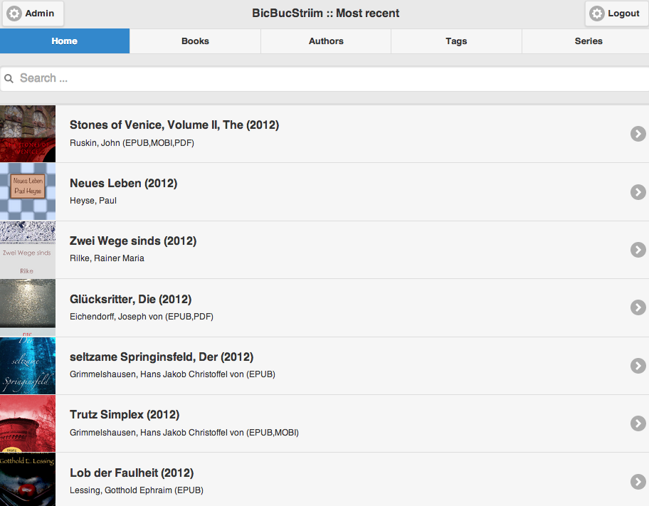

<!--
NOTA: Este README foi creado automáticamente por <https://github.com/YunoHost/apps/tree/master/tools/readme_generator>
NON debe editarse manualmente.
-->

# BicBucStriim para YunoHost

[](https://dash.yunohost.org/appci/app/bicbucstriim)  

[](https://install-app.yunohost.org/?app=bicbucstriim)

*[Le este README en outros idiomas.](./ALL_README.md)*

> *Este paquete permíteche instalar BicBucStriim de xeito rápido e doado nun servidor YunoHost.*  
> *Se non usas YunoHost, le a [documentación](https://yunohost.org/install) para saber como instalalo.*

## Vista xeral

BicBucStriim is a simple PHP application that runs in the Apache/PHP environment provided by the NAS (or any other server). It assumes that you manage your e-book collection with Calibre. The application reads the [Calibre](https://calibre-ebook.com/) data and publishes it in HTML form. To access the e-book catalog you simply point your ebook reader to your NAS, select one of your e-books and download it.


**Versión proporcionada:** 3.3.0~ynh2

## Capturas de pantalla



## Documentación e recursos

- Repositorio de orixe do código: <https://github.com/mikespub-org/rvolz-BicBucStriim>
- Tenda YunoHost: <https://apps.yunohost.org/app/bicbucstriim>
- Informar dun problema: <https://github.com/YunoHost-Apps/bicbucstriim_ynh/issues>

## Info de desenvolvemento

Envía a túa colaboración á [rama `testing`](https://github.com/YunoHost-Apps/bicbucstriim_ynh/tree/testing).

Para probar a rama `testing`, procede deste xeito:

```bash
sudo yunohost app install https://github.com/YunoHost-Apps/bicbucstriim_ynh/tree/testing --debug
ou
sudo yunohost app upgrade bicbucstriim -u https://github.com/YunoHost-Apps/bicbucstriim_ynh/tree/testing --debug
```

**Máis info sobre o empaquetado da app:** <https://yunohost.org/packaging_apps>
